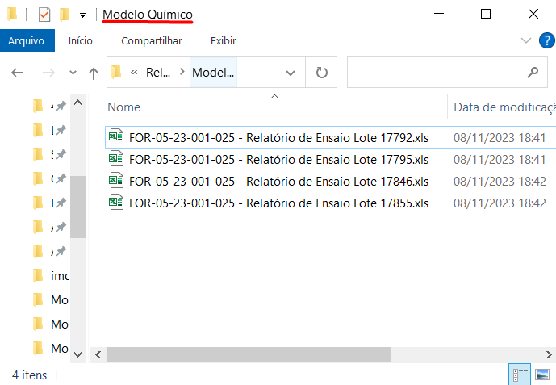
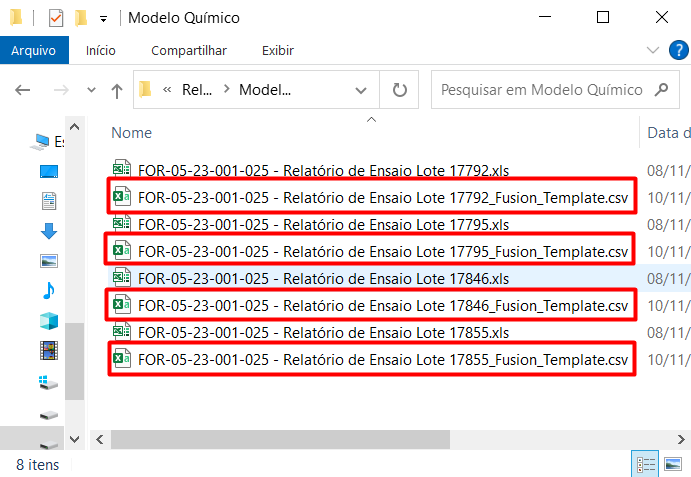

   

# LabReportConverter

Aplicativo que converte laudos para template no formato Fusion.

## Instruções de Uso

1. Ao executar o aplicativo **LabReportConverter.exe**, a seguinte janela será aberta:

   

2. Na lista suspensa **Tipo de Laudo**, selecione o tipo de relatório que deseja converter:

   

3. Clique no botão **Converter Laudo(s)**:

   

4. No Explorador de Arquivos do Windows, selecione uma pasta que contenha apenas laudos (em formato `.xls`) do tipo selecionado no item 2:

   

5. Para fins de exemplificação, suponha que a pasta selecionada foi **Modelo Químico**:

   

6. Veja que, após a conversão, quatro novos arquivos (.csv) com o sufixo `_Fusion_Template` foram adicionados à pasta. Esses arquivos são os templates associados à conversão dos quatro relatórios iniciais:

   

## Premissas

- O(s) relatório(s) de entrada deve(m) estar em formato `.xls` (i.e. Pasta de Trabalho do Excel 97-2003).
- O(s) template(s) de saída encontra(m)-se em formato `.csv`.
- O(s) template(s) de saída são nomeados de acordo com a seguinte lógica:
  - `Nome relatório de entrada` + `_Fusion_Template.csv`
  - **Exemplo:** _FOR-05-23-001-025 - Relatório de Ensaio Lote 17792_Fusion_Template.csv_
- O aplicativo converte apenas relatórios do laboratório interno da **revisão 08 (10/01/2023)**.
- O aplicativo converte apenas relatórios de três tipos:
  - Químico
  - Umidade
  - Densidade
- A **data de recebimento** encontra-se na célula `B19`.
- A **data de análise** depende do tipo de relatório:
  - No caso de **relatórios de química**, essa data encontra-se na célula `F10`.
  - No caso de **relatórios de umidade**, essa data encontra-se na célula `F17`
  - No caso de **relatórios de densidade**, essa data encontra-se na célula `F18`
- O **número de despacho** e o **número do lote** são iguais. Esse valor encontra-se na célula `I19`
- Os registros que contemplam os dados de número da amostra e seus resultados encontram-se a partir da **linha 22**.
- Os registros que contemplam os dados de número da amostra e seus resultados podem ser armazenados até, no máximo, a **linha 100**.
- Caso os registros que contemplam os dados de número da amostra e seus resultados não se extenderem até a **linha 100**, todos os valores em branco devem ser preenchidos com o símbolo `*`.
- Os dados de nome da amostra encontram-se sempre na coluna `A`, independetemente do tipo de relatório (i.e. químico, umidade ou densidade).
- No caso dos **relatórios químicos**, os analitos são:
  - **Au (g/t)**: coluna `B`
  - **Cu (%)**: coluna `C`
  - **S (%)**: coluna `D`
  - **Fe (%)**: coluna `E`
  - **Pb (%)**: coluna `F`
  - **Zn (%)**: coluna `G`
  - **Ag (g/t)**: coluna `H`
  - **Peso (kg)**: coluna `K`
- No caso dos **relatórios de umidade**, o único analito é:
  - **Umidade (%)**: coluna `I`
- No caso dos **relatórios de densidade**, o único analito é:
  - **Densidade (g/cm3)**: coluna `J`
- **Amostras de QA/QC interno não serão importadas para o banco**. Portanto, as amostras com as seguintes cadeias de caracteres no nome não serão registradas no template final:
  - **Padrões**: `CHKCAL` e `MR`
  - **Brancos**: `BRANCO`
- As **duplicatas físicas** são identificadas por possuírem a cadeia de caracteres `DF` em seu nome. Elas serão rotuladas com o código `D`.
- As **duplicatas de análise** são identificadas por possuírem a cadeia de caracteres `DQ` em seu nome. Elas serão rotuladas com o código `P`.
- As **amostras de umidade** são identificadas por possuírem a cadeia de caracteres `UMID` em seu nome. Elas serão rotuladas com o código `H`.
- As **amostras de densidade** são identificadas por possuírem a cadeia de caracteres `DENS` em seu nome. Elas serão rotuladas com o código `DE`.
- As **demais amostras** são aquelas que não apresentam nenhuma dessas cadeias de caracteres em seu nome. Elas serão rotuladas com o código `A`.

## Versões do Software
- python v3.9.18
- numpy v1.26.1
- pandas v2.1.2
- xlrd v2.0.1
- pyinstaller v6.1.0
